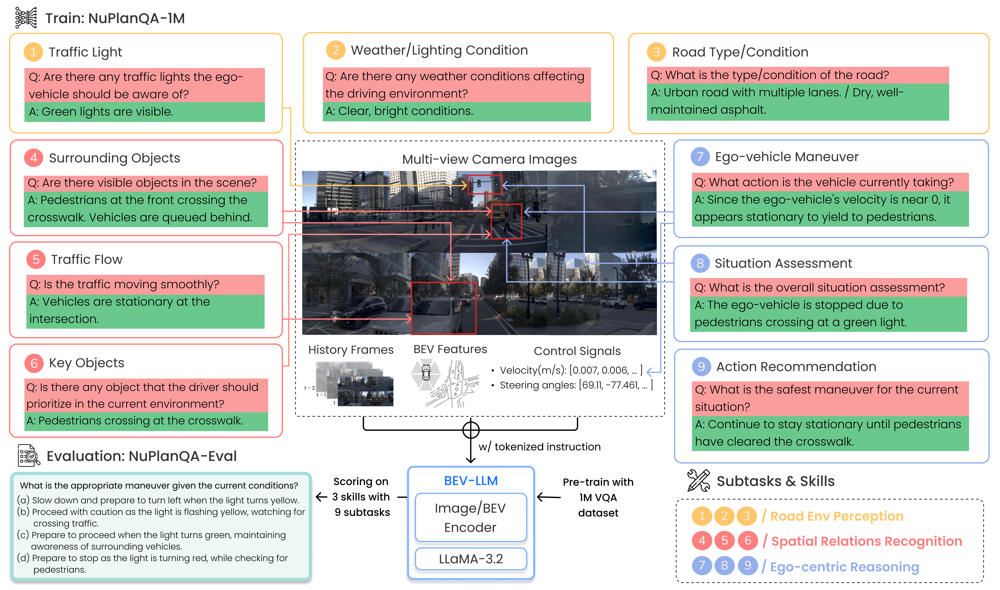

# [ICCV 2025] NuPlanQA: A Large-Scale Dataset and Benchmark for Multi-View Driving Scene Understanding in Multi-Modal Large Language Models
This is the offical Github repository of NuPlanQA.

**[NuPlanQA: A Large-Scale Dataset and Benchmark for Multi-View Driving Scene Understanding in Multi-Modal Large Language Models](https://arxiv.org/abs/2503.12772)**
</br>
[Sung-Yeon Park](https://www.linkedin.com/in/syparkway/),
[Can Cui](https://cancui19.github.io/),
[Yunsheng Ma](https://ysma.me/),
[Ahmadreza Moradipari](https://www.linkedin.com/in/ahmadrezamoradipari/),
[Rohit Gupta](https://www.linkedin.com/in/rohitbmw/),
[Kyungtae Han](https://www.linkedin.com/in/kthan/),
[Ziran Wang](https://ziranw.github.io/),
</br>
*International Conference on Computer Vision, ICCV 2025*

[](https://arxiv.org/abs/2503.12772)

<!-- ## Introduction
Panda-70M is a large-scale dataset with 70M high-quality video-caption pairs.
This repository have three sections:
- [Dataset Dataloading](./dataset_dataloading) includes the csv files listing the data of Panda-70M and the code to download the dataset.
- [Splitting](./splitting) includes the code to split a long video into multiple semantics-consistent short clips.
- [Captioning](./captioning) includes the proposed video captioning model trained on Panda-70M. -->



## 🔥 Updates
**[Jul 2025]** Release NuPlanQA dataset.

## ⚡ Preparing NuPlanQA Dataset

### Collection Pipeline


### 1. Download Raw Multi-view Images
Download the raw image data from the official [nuPlan website](https://www.nuscenes.org/nuplan#download).  
You should download:

- *nuPlan v1.1 Dataset > nuPlan Train Camera 32–42*
- *nuPlan v1.1 Dataset > nuPlan Val Camera 0–1*

We recommend unzipping each subset into its own directory, following the structure: `part_{num}/*.jpg`.


### 2. Download QA Dataset
You can download each split of the dataset using the links below. The data is available via either **Google Drive** or **Git LFS** in [this directory](https://github.com/sungyeonparkk/NuPlanQA/tree/main/data).

> ⚠️ Make sure to [install Git LFS](https://git-lfs.github.com/) before cloning if you choose the Git LFS option.

The evaluation results reported in the paper are based on the **Eval-test** split.

The dataset has been reorganized using `sample_token` (originally `ego_pose_token` in nuPlan) for easier indexing.  
You can construct sequences by following the `prev_token` field, enabling sequential predictions.

> ⏱️ Samples in the QA dataset are extracted at **2 Hz**, while the original nuPlan dataset operates at **10 Hz**.

For detailed information about each sample, please refer to the accompanying **metadata file**.


<details>
<summary>Click to see example of QA data</summary>

```shell
{'sample_token': 'eb2d7696f29451f8',
 'QA': [{'q': 'You are driving on the road. Based on given images of the surroudings of your vehicle and information from your vehicle extracted past 1.5 seconds, choose right answer among (a) to (d) for the given question.\n- Velocity(m/s): [5.324, 4.671, 4.045, 3.469, 2.84]\n- Steering angles: [-0.027, -0.008, 0.171, 0.424, 0.236]\n\n Are there any traffic lights ahead that the ego-vehicle must follow?\n\n(a) Red light is visible.\n(b) Yellow light is visible.\n(c) Green light is visible.\n(d) No traffic light is visible.',
   'a': '(a) Red light is visible.'}],
 'task': 'Traffic Light',
 'split': 'test',
 'prev': 'e10d6158220b529e'}
```
</details><br>

  | Split           | Download | # Samples |
  |-----------------|----------|-----------|
  | Train | [link](https://drive.google.com/file/d/182Snggw12JccHoeS8WNA9OzbFhnxeUY_/view?usp=drive_link) (462MB) | 977,395 |
  | Eval-test | [link](https://github.com/sungyeonparkk/NuPlanQA/blob/main/data/nuplanqa_eval_test.json) (1.4 MB)  | 1,801 |
  | Eval-train | - | 4,634 |
  | Eval-val | - | 1,750 |

### 3. Download Metadata
You can download the preprocessed metadata [here](https://drive.google.com/file/d/1fVmHsg3Nr3dde5vq3uoiC9obWrJ2vh-b/view?usp=sharing).  
It includes sample-level information such as camera intrinsics/extrinsics, image paths, and prev/next tokens for sequence construction.

<details>
<summary>Click to see example of metadata</summary>

It consists of 'cams', 'ego_pose', 'frame_idx', 'timestamp', 'scene_token', 'scenario', 'lidar', 'traffic_light', 'prev', 'next', 'can_bus', 'ego2global_translation', 'ego2global_rotation', 'lidar2ego_translation', 'lidar2ego_rotation'.

```shell
{'cams': {'CAM_F0': {'data_path': 'part_0/a9522f0e9fdf5686.jpg',
   'sensor2ego_translation': [1.670100095641242,
    -0.025874952985450953,
    1.5226234965806427],
   'sensor2ego_rotation': [-0.4921798295404226,
    0.509221874937493,
    -0.503330567358885,
    0.4950862929236553],
   'cam_intrinsic': [[1545.0, 0.0, 960.0],
    [0.0, 1545.0, 560.0],
    [0.0, 0.0, 1.0]],
   'sensor2lidar_rotation': [[0.0030556145965141912,
     -0.025432508383225288,
     0.999671871534242],
    [-0.9999566096412665, -0.008875020581252096, 0.0028306968091678097],
    [0.008800116714035612, -0.9996371449316093, -0.0254585234999955]],
   'sensor2lidar_translation': [1.6425227979198098,
    -0.025946764275431633,
    1.522686457814416],
   'ego2global_rotation': [0.9865768794330294,
    0.0022546782886687005,
    0.025673933839877157,
    -0.16125081864966173],
   'ego2global_translation': [664400.8907213148,
    3997308.8095567534,
    620.6470825320852]},
  'CAM_R0': {'data_path': 'part_0/d1f042880a155552.jpg',
   'sensor2ego_translation': [1.626167683662152,
    -0.16151727874097432,
    1.5262691183838457],
   'sensor2ego_rotation': [-0.2144582465632594,
    0.2054237701782263,
    -0.6740565072760993,
    0.6763553504819203],
   'cam_intrinsic': [[1545.0, 0.0, 960.0],
    [0.0, 1545.0, 560.0],
    [0.0, 0.0, 1.0]],
   'sensor2lidar_rotation': [[-0.823617470253551,
     0.013165506960416079,
     0.5669928854223977],
    [-0.5670344231117095, 0.0006890290404838461, -0.8236938073370176],
    [-0.011235021117550996, -0.999913093556363, 0.006897799289018185]],
   'sensor2lidar_translation': [1.6261676837457344,
    -0.16151727829128504,
    1.526269118381606],
   'ego2global_rotation': [0.9865822544781467,
    0.0022626194480383634,
    0.025590982084816815,
    -0.16123100613090938],
   'ego2global_translation': [664400.9170644955,
    3997308.800775011,
    620.6453262541245]},
  'CAM_L0': {'data_path': 'part_0/01c9b399bf1e5998.jpg',
   'sensor2ego_translation': [1.6463542201687589,
    0.14336933851072903,
    1.521468645940352],
   'sensor2ego_rotation': [-0.6700183826942894,
    0.6793536580752746,
    -0.20791502568012019,
    0.21523316707214654],
   'cam_intrinsic': [[1545.0, 0.0, 960.0],
    [0.0, 1545.0, 560.0],
    [0.0, 0.0, 1.0]],
   'sensor2lidar_rotation': [[0.8208472750352106,
     0.005631267094636907,
     0.5711199873040493],
    [-0.5709842828792725, -0.015831387028341304, 0.8208083307871585],
    [0.013663812502797298, -0.9998588180416609, -0.009779785898508864]],
   'sensor2lidar_translation': [1.5911925619002432,
    0.1433482808060944,
    1.521080838276248],
   'ego2global_rotation': [0.9865717693181968,
    0.002217250218595656,
    0.025746261605851757,
    -0.1612710693185664],
   'ego2global_translation': [664400.8643878335,
    3997308.8183764243,
    620.6482883864637]},
  'CAM_B0': {'data_path': 'part_0/1cea2fe4169f5b44.jpg',
   'sensor2ego_translation': [-0.4866409369975697,
    -0.0005954995062043893,
    1.4863210972954488],
   'sensor2ego_rotation': [-0.498582046231349,
    0.5038506943063591,
    0.49782257491778836,
    -0.4997230282116118],
   'cam_intrinsic': [[1545.0, 0.0, 960.0],
    [0.0, 1545.0, 560.0],
    [0.0, 0.0, 1.0]],
   'sensor2lidar_rotation': [[0.004832204390017736,
     0.003446442714299411,
     -0.9999823857615436],
    [0.9999630766252461, -0.007122690995709816, 0.004807562703791568],
    [-0.007105996545478203, -0.9999686941627701, -0.0034807337587017062]],
   'sensor2lidar_translation': [-0.46156024595256895,
    -0.0003719762898981571,
    1.4858332904841518],
   'ego2global_rotation': [0.9865888631659042,
    0.00228260342280803,
    0.025539503780504992,
    -0.16119844461181557],
   'ego2global_translation': [664400.9410278016,
    3997308.7930790987,
    620.6435921733774]},
  'CAM_L2': {'data_path': 'part_0/0288ab9686e55df7.jpg',
   'sensor2ego_translation': [-0.48509993976629096,
    0.5433909081944525,
    1.3868850667810126],
   'sensor2ego_rotation': [-0.6324979654261428,
    0.6441612393884576,
    0.3076457623355241,
    -0.3005939226237121],
   'cam_intrinsic': [[1545.0, 0.0, 960.0],
    [0.0, 1545.0, 560.0],
    [0.0, 0.0, 1.0]],
   'sensor2lidar_rotation': [[0.6299191686397443,
     0.016334222391454958,
     -0.7764889143826068],
    [0.7766577343437188, -0.010485694722020286, 0.6298355451149749],
    [0.002145848152702306, -0.9998116039459947, -0.019291240256718977]],
   'sensor2lidar_translation': [-0.4326466617640108,
    0.5435993396677077,
    1.3860953343391884],
   'ego2global_rotation': [0.9865929375151672,
    0.0023008264536260935,
    0.025465109950906926,
    -0.16118501797007065],
   'ego2global_translation': [664400.9671768147,
    3997308.7843736564,
    620.6418825465587]},
  'CAM_R2': {'data_path': 'part_0/61a1f0d2bc275a33.jpg',
   'sensor2ego_translation': [-0.49762319691681833,
    -0.504670120512021,
    1.3910581307716818],
   'sensor2ego_rotation': [-0.29884824445642777,
    0.3134657162947481,
    0.6402146697922491,
    -0.6344715502494442],
   'cam_intrinsic': [[1545.0, 0.0, 960.0],
    [0.0, 1545.0, 560.0],
    [0.0, 0.0, 1.0]],
   'sensor2lidar_rotation': [[-0.6249092960425192,
     0.022244688923617795,
     -0.780380385154787],
    [0.7805506751328777, -0.0015739838776591103, -0.6250905263434743],
    [-0.015133250452286195, -0.9997513172731727, -0.016379509800480477]],
   'sensor2lidar_translation': [-0.4724993302952498,
    -0.5044421618804336,
    1.390541890388704],
   'ego2global_rotation': [0.9865888631659042,
    0.00228260342280803,
    0.025539503780504992,
    -0.16119844461181557],
   'ego2global_translation': [664400.9410278016,
    3997308.7930790987,
    620.6435921733774]}},
 'ego_pose': {'x': 664400.9170644955,
  'y': 3997308.800775011,
  'z': 620.6453262541245,
  'qw': 0.9865822544781467,
  'qx': 0.0022626194480383634,
  'qy': 0.025590982084816815,
  'qz': -0.16123100613090938,
  'vx': 2.840005280646528,
  'vy': -0.04869518320225008,
  'vz': -0.034115212456105104,
  'acceleration_x': -1.0838809462134669,
  'acceleration_y': -0.025555212997457503,
  'acceleration_z': 0.09727290168084729,
  'angular_rate_x': 0.004252719145504743,
  'angular_rate_y': -0.01647786244731052,
  'angular_rate_z': 0.004183400830237869,
  'epsg': 32611},
 'frame_idx': 673,
 'timestamp': 1623105481598617,
 'scene_token': 'b086d06f6f01509e',
 'scenario': '',
 'lidar': {'lidar2ego_translation': [0, 0, 0],
  'lidar2ego_rotation': [1.0, 0.0, 0.0, 0.0]},
 'traffic_light': ['red', 'green'],
 'prev': 'e10d6158220b529e',
 'next': '417962b1cde65f78',
 'can_bus': [664400.9170644955,
  3997308.800775011,
  620.6453262541245,
  0.9865822544781467,
  0.0022626194480383634,
  0.025590982084816815,
  -0.16123100613090938,
  -1.0838809462134669,
  -0.025555212997457503,
  0.09727290168084729,
  0.004252719145504743,
  -0.01647786244731052,
  0.004183400830237869,
  2.840005280646528,
  -0.04869518320225008,
  -0.034115212456105104,
  0.0,
  0.0],
 'ego2global_translation': [664400.9170644955,
  3997308.800775011,
  620.6453262541245],
 'ego2global_rotation': [0.9865822544781467,
  0.0022626194480383634,
  0.025590982084816815,
  -0.16123100613090938],
 'lidar2ego_translation': [0, 0, 0],
 'lidar2ego_rotation': [1.0, 0.0, 0.0, 0.0]}
```
</details><br>

You will need to install `nuplan-devkit` to open metadata file. Follow [official instruction](https://nuplan-devkit.readthedocs.io/en/latest/installation.html) to install.

## 🌁 Samples


## ⌛ To Do

☑︎ Release NuPlanQA-Eval(test)  
☑︎ Release NuPlanQA-1M  
□ Release NuPlanQA-Eval(train/val)  

## 📖 Citation
If you find this project useful for your research, please cite our paper.

```bibtex
@misc{park2025nuplanqalargescaledatasetbenchmark,
      title={NuPlanQA: A Large-Scale Dataset and Benchmark for Multi-View Driving Scene Understanding in Multi-Modal Large Language Models}, 
      author={Sung-Yeon Park and Can Cui and Yunsheng Ma and Ahmadreza Moradipari and Rohit Gupta and Kyungtae Han and Ziran Wang},
      year={2025},
      eprint={2503.12772},
      archivePrefix={arXiv},
      primaryClass={cs.CV},
      url={https://arxiv.org/abs/2503.12772}, 
}
```

## Contact Information
**Sung-Yeon Park**: [sy.park574@gmail.com](mailto:sy.park574@gmail.com) 


